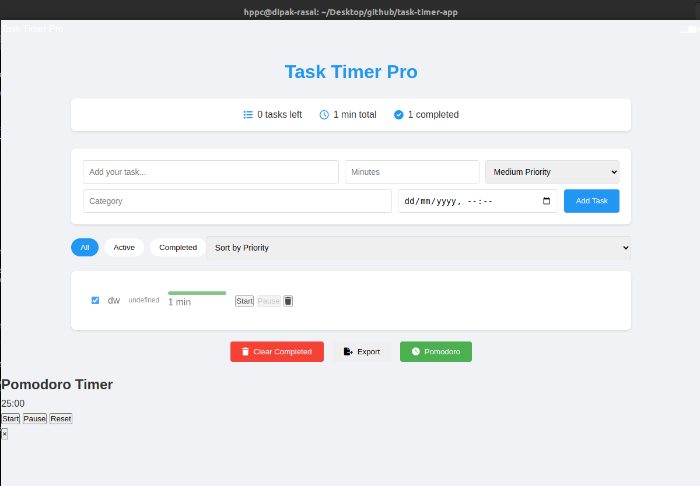

# Task Timer Pro

A professional task management and time tracking desktop application built with Electron. Keep track of your tasks, manage time effectively, and boost your productivity.



## Features

- 📝 Task Management with Priority Levels
- ⏲️ Pomodoro Timer Integration
- 🎯 Progress Tracking
- 🔔 Desktop Notifications
- 💻 System Tray Integration
- 🌙 Dark Mode Support
- 📊 Task Statistics
- 📅 Task Scheduling
- 🏷️ Task Categories
- 💾 Auto-save Feature

## Installation Guide

### Method 1: Quick Installation (Recommended for Ubuntu/Debian)
```bash
# Download the installation script
wget https://raw.githubusercontent.com/dipakrasal2009/task-timer-pro/main/install.sh

# Make it executable
chmod +x install.sh

# Run the installation script
sudo ./install.sh
```

The script will automatically:
- Check system requirements
- Install necessary dependencies
- Build and install the application
- Create desktop shortcuts
- Set up system integration

### Method 2: Manual Installation

#### Prerequisites
- Node.js (v14 or later)
- npm (v6 or later)

#### For Ubuntu/Debian Users:

1. Clone the repository:
```bash
git clone https://github.com/dipakrasal2009/task-timer-pro.git
cd task-timer-pro
```

2. Install dependencies:
```bash
npm install
```

3. Build the application:
```bash
npm run dist
```

4. Install the .deb package:
```bash
sudo dpkg -i dist/task-timer-pro_1.0.0_amd64.deb
sudo apt-get install -f # Fix any dependencies
```

#### For Other Linux Users:

1. Download the AppImage from releases:
```bash
wget https://github.com/dipakrasal2009/task-timer-pro/releases/download/v1.0.0/Task.Timer.Pro-1.0.0.AppImage
```

2. Make it executable:
```bash
chmod +x Task.Timer.Pro-1.0.0.AppImage
```

3. Run the application:
```bash
./Task.Timer.Pro-1.0.0.AppImage
```

## Development Setup

1. Clone the repository:
```bash
git clone https://github.com/dipakrasal2009/task-timer-pro.git
cd task-timer-pro
```

2. Install dependencies:
```bash
npm install
```

3. Start in development mode:
```bash
npm start
```

4. Build for distribution:
```bash
npm run dist
```

## Project Structure

```
task-timer-app/
├── src/
│   ├── assets/        # Images and sounds
│   ├── styles/        # CSS files
│   ├── scripts/       # JavaScript files
│   └── index.html     # Main HTML file
├── main.js            # Electron main process
├── package.json       # Project configuration
└── install.sh         # Installation script
```

## Usage

1. Launch the application from:
   - Applications menu
   - Desktop shortcut
   - Terminal: `task-timer-pro`

2. Add tasks with:
   - Task name
   - Duration
   - Priority
   - Category (optional)
   - Schedule (optional)

3. Use features:
   - Start/pause tasks
   - Track progress
   - Use Pomodoro timer
   - Export task data
   - View statistics

## Troubleshooting

### Common Issues

1. If the application doesn't start:
```bash
# Check if it's installed correctly
which task-timer-pro

# Try running from terminal for error messages
task-timer-pro
```

2. For permission issues:
```bash
# Fix ownership
sudo chown -R $USER:$USER ~/.config/task-timer-pro

# Fix permissions
chmod +x /usr/bin/task-timer-pro
```

3. For dependency issues:
```bash
sudo apt-get install -f
```

## Updates

To update to the latest version:
```bash
# Using installation script
sudo ./install.sh --update

# Or manually
sudo dpkg -i task-timer-pro_new-version_amd64.deb
```

## Uninstallation

```bash
# For .deb package installation
sudo apt remove task-timer-pro

# For AppImage
rm Task.Timer.Pro-1.0.0.AppImage
rm ~/.local/share/applications/task-timer-pro.desktop
```

## Contributing

1. Fork the repository
2. Create your feature branch
3. Commit your changes
4. Push to the branch
5. Create a Pull Request

## Support

- Issue Tracker: [GitHub Issues](https://github.com/dipakrasal2009/task-timer-pro/issues)
- Email: dipakrasal2009@gmail.com

## License

This project is licensed under the MIT License - see the [LICENSE](LICENSE) file for details.

## Acknowledgments

- Electron.js team
- Node.js community
- All contributors

---
Made with ❤️  by Dipak Rasal

